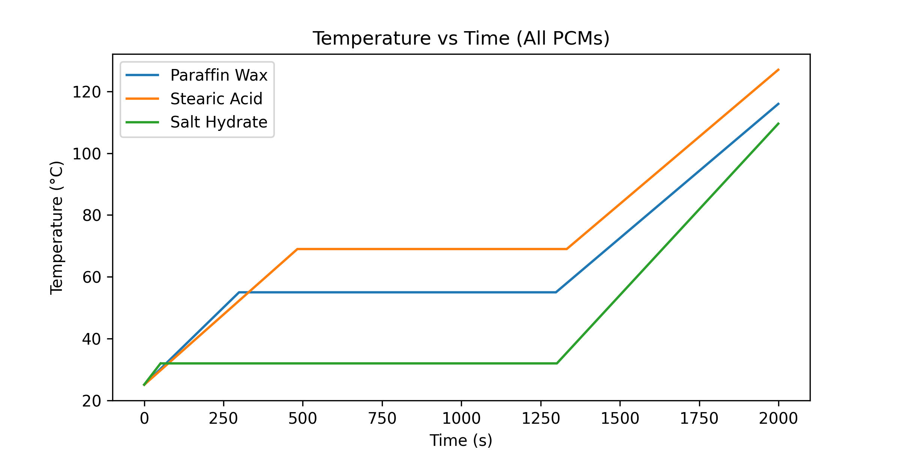
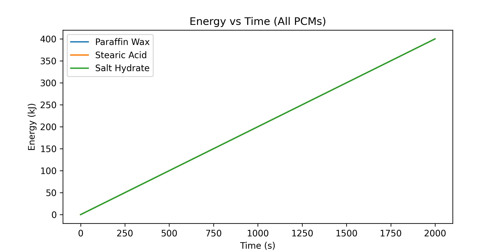

# Thermal Energy Storage Using Phase Change Materials (PCMs)

## Overview
This project simulates thermal energy storage using different **Phase Change Materials (PCMs)**, including:

- Paraffin Wax
- Stearic Acid
- Salt Hydrate

The simulation tracks temperature evolution and energy stored during heating, phase change, and post-melting stages.  
It covers:

- Time-stepping simulation for each PCM  
- Calculation of temperature over time  
- Calculation of energy stored during heating and phase change  
- Visualization of temperature vs time and energy vs time  
- Export of simulation results to CSV files for further analysis

---

## Project Structure
```
Thermal-Energy-Storage-using-PCMs/
│
├── plots/
├── simulations/
│ 	├── Thermal-Energy-Storage-using-PCMs.py
│ 	└── Thermal-Energy-Storage-using-PCMs.ipynb
├── csvs/
├── requirements.txt
├── .gitignore
└── README.md
```

---

## Installation Instructions

1. **Clone the repository**
```bash
git clone https://github.com/mzohaibh17-pixel/Thermal-Energy-Storage-using-PCMs.git
cd Thermal-Energy-Storage-using-PCMs
```

2. **Create a virtual environment and activate it**
```bash
python -m venv venv
venv\Scripts\activate        # Windows
# source venv/bin/activate   # Linux / Mac
```

3. **Install dependencies**
```bash
pip install -r requirements.txt
```

---

## Features

- Simulates thermal energy storage using multiple Phase Change Materials (PCMs):
  - Paraffin Wax
  - Stearic Acid
  - Salt Hydrate
- Tracks temperature evolution for each PCM over time
- Calculates energy stored during:
  - Solid heating
  - Melting plateau
  - Liquid heating
- Generates visualizations:
  - Temperature vs Time
  - Energy vs Time
- Saves simulation results to CSV files for further analysis
- Supports both Python script and Jupyter notebook execution for interactive exploration

The project is implemented in both a Python script and Jupyter notebooks located in the `simulations/` folder for interactive exploration.

---

## Usage

1. **Run the Jupyter notebook** (recommended for interactive exploration):
```bash
jupyter notebook simulations/Thermal-Energy-Storage-using-PCMs.ipynb
```
2. **Or run the Python script**:
```bash
python simulations/Thermal-Energy-Storage-using-PCMs.py
```

- Plots will be saved automatically in the `plots/` folder.
- CSV files containing time, temperature, and energy data will be saved in the `csvs/ folder`.
- You can modify PCM properties or simulation parameters (mass, power, time step, total simulation time, initial temperature) directly in the script or notebook.

---

## Outputs

The simulation produces the following outputs for each PCM:

- Plots (saved in `plots/` folder):
  - Temperature vs Time for all PCMs
  - Energy vs Time for all PCMs

- CSV files (saved in `csvs/` folder) containing:
  - Time (s)
  - Temperature (°C)
  - Energy stored (kJ)

- Total energy stored for each PCM printed in the console, for example:

```
The energy stored by each PCM is:
Paraffin Wax: 400.00 kJ
Stearic Acid: 400.00 kJ
Salt Hydrate: 400.00 kJ
```

These outputs allow visual comparison of **temperature response** of different PCMs under identical heating conditions.

---

## Dependencies

This project requires the following Python packages:
```
- Python 3.x
- numpy
- pandas
- matplotlib
```
*(All dependencies are included in `requirements.txt` for easy installation using `pip install -r requirements.txt`)*

---

## References

- Matplotlib Documentation: https://matplotlib.org/stable/contents.html  
- NumPy Documentation: https://numpy.org/doc/stable/  
- Pandas Documentation: https://pandas.pydata.org/docs/  
- Basics of Phase Change Materials (PCMs): https://en.wikipedia.org/wiki/Phase-change_material  
- Thermal Energy Storage Concepts: https://www.sciencedirect.com/topics/engineering/thermal-energy-storage

---

## Author / Credits

**Muhammad Zohaib Hassan**  
Bachelor’s in Physics, University of Sargodha  
GitHub: [mzohaibh17-pixel](https://github.com/mzohaibh17-pixel)  
Email: mzohaibh17@gmail.com  

This project is developed for educational and research purposes in Thermal Energy Storage using **Phase Change Materials (PCMs)**.  
It is licensed under the **MIT License**, which requires including the copyright notice in any copies or substantial portions of the software.  
If you use, adapt, or fork this project, please give proper credit to the author.

---

## Visualizations

The following plots provide a visual summary of the Thermal Energy Storage simulation using PCMs.  
They help illustrate how temperature and energy evolve over time for different materials.

### Temperature vs Time for All PCMs


### Energy vs Time for All PCMs

